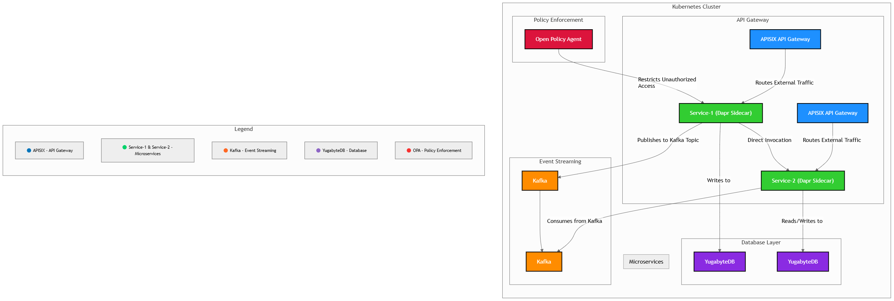

# **🚀 Kubernetes Microservices with OPA, APISIX, KEDA, Yugabyte, Dapr, and Kafka**

## **📌 Project Overview**
This project demonstrates a **Kubernetes-based microservices architecture** using the following technologies:

- **[Open Policy Agent (OPA)](https://www.openpolicyagent.org/)** - Policy-based access control
- **[APISIX](https://apisix.apache.org/)** - API gateway & load balancer
- **[KEDA](https://keda.sh/)** - Kubernetes event-driven autoscaler
- **[YugabyteDB](https://www.yugabyte.com/)** - Distributed SQL database
- **[Dapr](https://dapr.io/)** - Service-to-service communication & Pub/Sub
- **[Kafka](https://kafka.apache.org/)** - Message broker
- **Two Test Microservices** - Sample microservices implementing the stack

### **🎯 Key Objectives**
- Deploy a **scalable** and **secure** microservices environment using Kubernetes.
- Implement **OPA-based access policies** to restrict inter-service communication.
- Use **APISIX** as the API gateway and **Kafka** for asynchronous messaging.
- Integrate **Dapr** for service-to-service communication with **direct invocation & Pub/Sub**.
- Enable **KEDA** to scale services dynamically based on event-driven triggers.
- Store application data using **YugabyteDB** (Temporarily skipped due to container issues).

---

## **📂 Project Folder Structure**

k8s-microservices-dapr-opa-apisix/
│── microservices/
│   ├── service-1/
│   │   ├── src/
│   │   │   ├── controllers/
│   │   │   ├── models/
│   │   │   ├── routes/
│   │   │   ├── services/
│   │   ├── config/
│   │   │   ├── db.js
│   │   │   ├── kafka.js
│   │   │   ├── dapr.js
│   │   ├── security/
│   │   │   ├── opa-check.js
│   │   │   ├── middleware.js
│   │   │   ├── helmet-config.js
│   │   │   ├── rate-limit.js
│   │   ├── Dockerfile
│   │   ├── package.json
│   │   ├── .gitignore
│   │   ├── README.md
│   │
│   ├── service-2/  # Same structure as service-1
│
│── kubernetes/
│   ├── apisix/
│   │   ├── apisix.yaml
│   │   ├── ingress.yaml
│   │
│   ├── opa/
│   │   ├── policies/
│   │   │   ├── service-access.rego
│   │   ├── opa-deployment.yaml
│   │   ├── opa-config.yaml
│   │
│   ├── dapr/
│   │   ├── components.yaml
│   │
│   ├── kafka/
│   │   ├── kafka-deployment.yaml
│   │   ├── kafka-topic.yaml
│   │
│   ├── yugabyte/
│   │   ├── yugabyte-deployment.yaml
│   │   ├── yugabyte-service.yaml
│
│   ├── services/
│   │   ├── service-1-deployment.yaml
│   │   ├── service-1-service.yaml
│   │   ├── service-2-deployment.yaml
│   │   ├── service-2-service.yaml
│
│   ├── namespace.yaml
│
│── security/
│   ├── opa-policies/
│   ├── rbac.yaml
│   ├── network-policies.yaml
│
│── minikube-setup.sh
│── README.md


---

## **⚙️ Setup & Deployment**
### **1️⃣ Prerequisites**
Ensure you have the following installed:
- [Minikube](https://minikube.sigs.k8s.io/docs/start/) or Kubernetes cluster  
- [kubectl](https://kubernetes.io/docs/tasks/tools/install-kubectl/)  
- [Helm](https://helm.sh/docs/intro/install/)  
- [Dapr CLI](https://docs.dapr.io/getting-started/install-dapr-cli/)  
- [Kafka CLI](https://kafka.apache.org/quickstart)  
- [Docker](https://docs.docker.com/get-docker/)  

### **2️⃣ Clone Repository**
```sh
git clone https://github.com/DahunsiJ/k8s-microservices-dapr-opa-apisix.git
cd k8s-microservices-dapr-opa-apisix
```

### **3️⃣ Start Minikube**
```sh

minikube start --memory=8192 --cpus=4
```

### **4️⃣ Deploy Infrastructure**
```sh

kubectl apply -f kubernetes/
```

### **5️⃣ Verify Deployments**
```sh

kubectl get pods -A
```

### **6️⃣ Test API Gateway (APISIX)**
```sh

curl -X GET "http://$(minikube ip):30080/service-1/api/hello"
```

### **7️⃣ Test OPA Policy Blocking Communication**
```sh

curl -X POST "http://$(minikube ip):30080/service-1/api/call-service-2"
Expected: Blocked during restricted hours.
```

### **8️⃣ Test Kafka Pub/Sub**
```sh
kubectl exec -it kafka-0 -- kafka-console-producer --broker-list kafka:9092 --topic orders
> {"order_id": "12345", "status": "created"}
```


🖼 Architecture Diagram
📌 ****


🎥 Demo Video
📌 (Upload a screen recording to the demo/ folder and provide a link here.)
🔗 Watch the Demo

👨‍💻 Contributors
Justus Dahunsi

📌 Issues & Future Improvements
✅ Current Issue: YugabyteDB is failing due to a distroless image issue.
💡 Potential Fix: Use PostgreSQL as a fallback storage solution.

📧 Submission Details
✅ GitHub Repo Shared: temmyonfire@gmail.com (added as a collaborator)
✅ Demo Video Recorded
✅ Email Sent to: admin@upi.dev